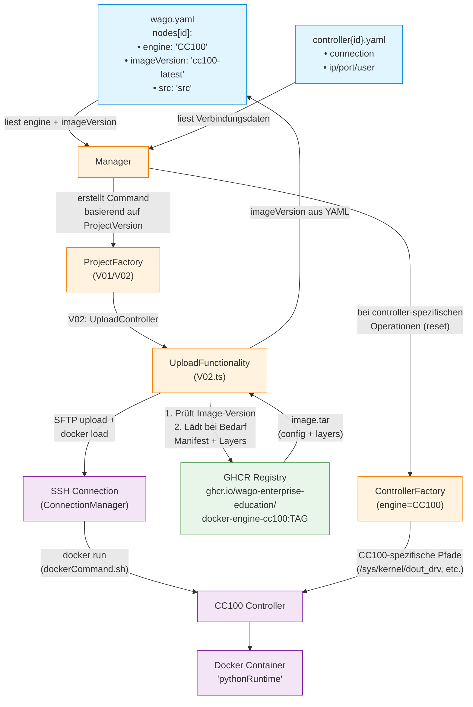

# Vereinfachte Architektur: Image, Container & Engines

## Kernpunkte

### 1. Image-Festlegung
- **wo**: `wago.yaml` → `nodes[id].imageVersion` (z.B. `"cc100-latest"`)
- **wer nutzt es**: `UploadFunctionality` (in `V02.ts`) liest die Version und lädt bei Bedarf von GHCR

### 2. Container-Start
- **SSH exec**: `ConnectionManager` führt entweder `docker start pythonRuntime` aus (falls Container existiert)
- **oder**: Script `dockerCommand.sh <imageVersion>` → `docker run ... ghcr.io/.../docker-engine-cc100:<tag>`
- **auf Gerät**: CC100 mit Docker Daemon

### 3. Engine-Implementierung
- **Festlegung**: `wago.yaml` → `nodes[id].engine` (aktuell nur `"CC100"`)
- **Factory-Pattern**: 
  - `Manager` → `ProjectFactory` (wählt V01/V02 Implementierung)
  - `Manager` → `ControllerFactory` (wählt CC100-spezifische Implementierung)
- **Controller-spezifisch**: Reset-Befehle, I/O-Pfade unterscheiden sich je nach Hardware
