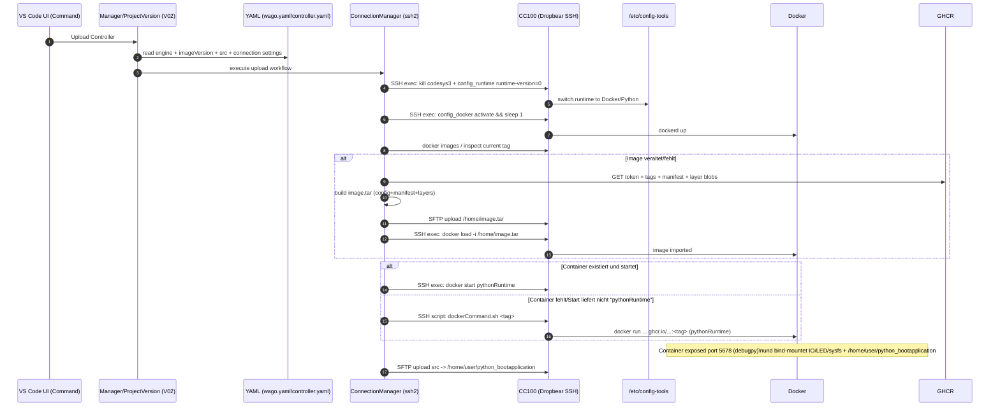

```mermaid
sequenceDiagram
  autonumber
  participant UI as VS Code UI (Command)
  participant M as Manager/ProjectVersion (V02)
  participant Y as YAML (wago.yaml/controller.yaml)
  participant SSH as ConnectionManager (ssh2)
  participant CC as CC100 (Dropbear SSH)
  participant CT as /etc/config-tools
  participant D as Docker
  participant GH as GHCR

  UI->>M: Upload Controller
  M->>Y: read engine + imageVersion + src + connection settings
  M->>SSH: execute upload workflow

  SSH->>CC: SSH exec: kill codesys3 + config_runtime runtime-version=0
  CC->>CT: switch runtime to Docker/Python
  SSH->>CC: SSH exec: config_docker activate && sleep 1
  CC->>D: dockerd up

  SSH->>CC: docker images / inspect current tag
  alt Image veraltet/fehlt
    SSH->>GH: GET token + tags + manifest + layer blobs
    SSH->>SSH: build image.tar (config+manifest+layers)
    SSH->>CC: SFTP upload /home/image.tar
    SSH->>CC: SSH exec: docker load -i /home/image.tar
    CC->>D: image imported
  end

  alt Container existiert und startet
    SSH->>CC: SSH exec: docker start pythonRuntime
  else Container fehlt/Start liefert nicht "pythonRuntime"
    SSH->>CC: SSH script: dockerCommand.sh <tag>
    CC->>D: docker run ... ghcr.io/...:<tag> (pythonRuntime)
  end

  Note over D: Container exposed port 5678 (debugpy)\nund bind-mountet IO/LED/sysfs + /home/user/python_bootapplication
  SSH->>CC: SFTP upload src -> /home/user/python_bootapplication
```